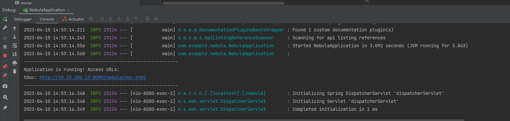
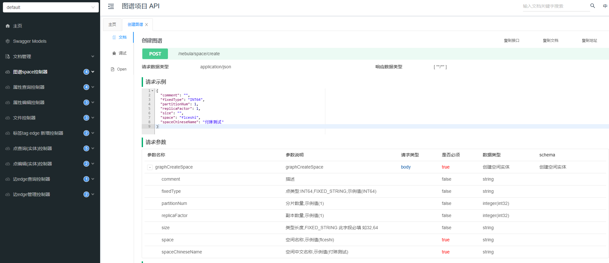

- 本项目集成了knife4j 启动项目后访问地址即可看到所有接口 

- 控制台会打印接口文档地址,点击即可访问

- 接口文档效果

### 2023-03-06 升级一版
- 升级内容: 
    - 1 文件导入,根据import插件导入
    - 2 部分阉割代码更新
    - 3 虽然控制器中的方法不是很多,但是由于阉割代码不好弄,其实NebulaUtil中的方法很多,很全,可以多看看,估计有你想要的方法

- 本项目属于阉割版: 
  - 由于开发中部分功能不满足需求,做了以mysql为数据库存储的与nebula的映射关系,例如给tag 增加大小,颜色等配置,之后作为解析等;
                  其中很多功能已经阉割掉;有问题请私聊,因为我改造后也没有具体测试过;

### 2023-04-10 升级一版
- 升级内容:
    - 1 将在线文档升级为ui风格更加好看的knife4j

##### 目前dev分支为最新分支,master分支为最稳定版本,需要各位小伙伴使用一段时间,后期会将升级后的升级到master分支
- 具体升级时间待定

### 感谢图数据库的鼓励

送了两次大礼包了,谢谢

nebula 图数据库相关文章:

- [图文数据库nebula奖励](https://blog.csdn.net/qq_32419139/article/details/125143297)
- [国产图数据库--Nebula实践](https://blog.csdn.net/qq_32419139/article/details/127203849)
- [国产图数据库--Nebula备份/恢复](https://blog.csdn.net/qq_32419139/article/details/127221752)

